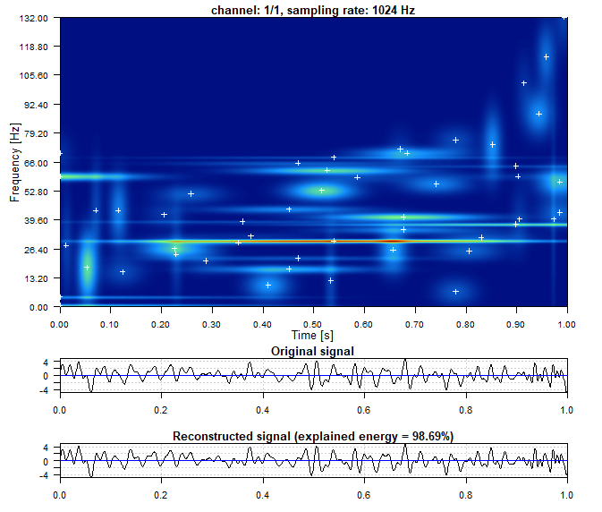
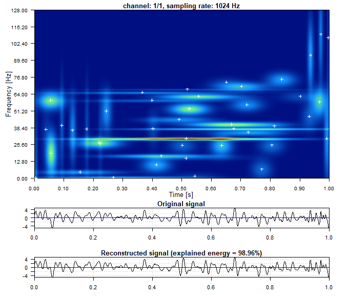
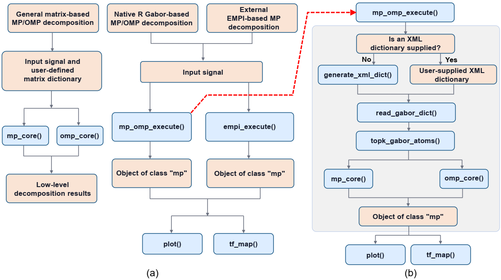

# MatchingPursuit: An R Framework for Sparse Time-Series Decomposition Using Matching Pursuit and Orthogonal Matching Pursuit

<!-- badges: start -->
[](https://CRAN.R-project.org/package=MatchingPursuit)
[](https://CRAN.R-project.org/package=MatchingPursuit)
[](https://cran.r-project.org/package=MatchingPursuit)
<!-- badges: end -->

## Purpose

Sparse signal decomposition framework for one- and multi-channel biomedical and 
general time-series data using the **Matching Pursuit** and **Orthogonal Matching Pursuit** 
algorithms. For multi-channel signals, each channel is decomposed independently; 
atoms are not selected jointly across channels.

The package provides two native R decomposition implementations, **MP-R** and **OMP-R**, 
together with the optional external **EMPI** backend for high-performance MP decomposition.

Supported features:

- Sparse decomposition using arbitrary user-defined dictionaries
- Native R implementations of:
    - Matching Pursuit (**MP-R**)
    - Orthogonal Matching Pursuit (**OMP-R**)
- An educational and reference implementation of OMP through `omp_reference()`
- Specialized Gabor dictionary support for time-frequency decomposition
- Optional high-performance Gabor-based Matching Pursuit using the external
  **Enhanced Matching Pursuit Implementation (EMPI)** backend
- Support for biomedical signal formats:
    - EDF / EDF+ files
    - WFDB records
    - three standard EEG montages (bipolar, referential, and average-reference montages)
- Plotting time-frequency maps for Gabor-based MP, OMP, and EMPI results
- Signal preprocessing using notch, low-pass, high-pass, band-pass, and band-stop filters

Note:

The terms **MP-R** and **OMP-R**, with the suffix **R**, refer to the corresponding 
native R backends rather than to the algorithms themselves. The terms **MP** and 
**OMP**, without the suffix **R**, refer to the corresponding algorithms rather 
than to a specific implementation.

## Installation

You can install the released version from
[CRAN](https://CRAN.R-project.org) with:

```r
install.packages("MatchingPursuit")
```

## Quick start

### MP-R and OMP-R: Gabor-based decomposition

For Gabor-based decomposition, `mp_omp_execute()` provides the high-level interface. 
It prepares the Gabor dictionary, selects candidate atoms, performs MP or OMP 
decomposition, combines the numerical results with Gabor metadata, and returns an 
object of class `"mp"`.

```r
sig_file <- system.file("extdata", "sample1.csv", package = "MatchingPursuit")
signal <- read_csv_signals(sig_file)

out_mp <- mp_omp_execute(
  signal = signal,
  mode = "mp",          # use "omp" for Orthogonal Matching Pursuit
  n_nonzero_coefs = 50,
  verbose = TRUE
)

plot(out_mp, channel = 1)
```

If `dictionary = NULL`, an XML Gabor dictionary specification is generated internally.

The time–frequency map below shows the energy distribution of the selected atoms. 
White crosses indicate the centers of individual time–frequency blobs, i.e. 
the atoms' central time and central frequency coordinates. The panels below 
show the original signal and its reconstruction; in this example, the reconstruction 
explains 98.69% of the signal energy.

<p align="center">
  
</p>

### Decomposition with a custom dictionary

The native R implementations can operate directly on arbitrary user-defined 
dictionaries. Dictionary atoms are supplied as columns of a numeric matrix and 
are normalized internally to unit L2 norm.

```r
N <- 256
t <- seq(0, 1, length.out = N)

dictionary <- cbind(
  sin(2 * pi * 5 * t),
  cos(2 * pi * 5 * t),
  sin(2 * pi * 10 * t),
  cos(2 * pi * 10 * t)
)

signal <- sin(2 * pi * 5 * t) + 0.5 * cos(2 * pi * 10 * t)

out <- omp_core(
  dictionary = dictionary,
  signal = signal,
  n_nonzero_coefs = 2
)

out$support
[1] 1 4

out$relative_residual_energy
[1] 1.000000e+00 2.012529e-01 4.867641e-32
```

In the example above, OMP correctly identifies atoms 1 and 4, corresponding to 
the 5 Hz sine and 10 Hz cosine components used to construct the signal. After 
two iterations, the residual energy is effectively zero.

### EMPI

EMPI is an optional external third-party backend used for high-performance
Matching Pursuit decomposition and is distributed separately under its own
GPL license. It is not part of the MatchingPursuit package.

EMPI must first be installed using the `empi_install()` function. The decomposition 
can then be performed using `empi_execute()` and visualized using `plot()`.

```r
sig_file <- system.file("extdata", "sample1.csv", package = "MatchingPursuit")
signal <- read_csv_signals(sig_file)

out_empi <- empi_execute(
  signal = signal
)

plot(out_empi, channel = 1)
```
This example illustrates an EMPI-based decomposition and its time–frequency 
representation. The map reveals several localized components distributed across 
time and frequency, while the reconstructed signal closely follows the original 
waveform. In this case, the selected atoms explain 98.96% of the signal energy.

<p align="center">
  
</p>


## Educational OMP implementation

For small illustrative and validation examples, `omp_reference()` provides a 
straightforward reference implementation that follows the mathematical 
formulation of OMP explicitly, including least-squares coefficient updates 
and residual orthogonality checks.

```r
ref <- omp_reference(
  dictionary = dictionary,
  signal = signal,
  n_nonzero_coefs = 2
)

ref$selected_atoms
[1] 1 4

ref$coefficients_original_dict
[1] 1.0 0.0 0.0 0.5

ref$normalized_reconstruction_error_original_dict
[1] 6.95e-16

ref$orthogonality
[[1]]
-5.03e-15

[[2]]
-5.30e-15  7.07e-15
```

The reference implementation recovers the exact coefficients of the original 
dictionary, while the near-zero reconstruction error and orthogonality values 
confirm the expected OMP properties.


## Package architecture

The package provides three main decomposition routes.

| Route | Main functions | Purpose | Recommended use |
|:--|:--|:--|:--|
| **General matrix-based MP/OMP** | `mp_core()`, `omp_core()` | Sparse decomposition with arbitrary matrix dictionaries | General sparse decomposition and experimentation |
| **Native R Gabor-based MP/OMP** | `mp_omp_execute()` | High-level Gabor-based MP or OMP decomposition | Time-frequency decomposition in R |
| **External EMPI-based MP** | `empi_execute()` | Optimized Gabor-based Matching Pursuit | High-performance time-frequency decomposition |

## Typical workflows

The diagram below summarizes the **three available decomposition workflows** and
their relationship within the package. Blue boxes denote R functions, whereas 
peach boxes represent workflow components, inputs, or returned objects. 
The dashed red line connects `mp_omp_execute()` in panel (a) with its internal 
workflow shown in panel (b).

<p align="center">
  
</p>

The **general matrix-based MP/OMP workflow** operates directly on a user-defined numeric
dictionary and input signal through `mp_core()` or `omp_core()`. It is independent
of the Gabor-specific dictionary construction utilities and can therefore be used
with arbitrary matrix dictionaries. These functions return low-level decomposition
results, giving the user direct control over the dictionary and the decomposition
procedure.

The **native R Gabor-based MP/OMP workflow**, implemented by `mp_omp_execute()`,
provides a higher-level interface for Gabor-based MP and OMP decomposition. It
integrates dictionary specification or generation, dictionary reading,
channel-specific atom preselection, decomposition with `mp_core()` or `omp_core()`,
and aggregation of the results into an object of class `"mp"`. If no XML dictionary
specification is supplied, `generate_xml_dict()` creates one internally; otherwise,
the user-provided XML file is used. The specification is processed by
`read_gabor_dict()`, after which `topk_gabor_atoms()` selects candidate Gabor atoms
for each signal channel.

The **external EMPI-based MP workflow** provides an alternative MP implementation
through `empi_execute()`. In this case, decomposition is performed by the external
high-performance C++ EMPI backend rather than by the native R MP/OMP core functions.
The wrapper integrates the external decomposition results into the same
package-level `"mp"` representation, allowing them to be handled using the same
downstream visualization functions, including `plot()` and `tf_map()`.

Thus, the three workflows differ in their level of abstraction, 
dictionary representation, and decomposition backend:: direct matrix-based 
MP/OMP for arbitrary user-defined dictionaries, the integrated native Gabor MP/OMP
workflow, and the external EMPI-based Gabor MP workflow. The latter two return a
common `"mp"` object, facilitating consistent visualization and interpretation
within the package.


## Reproducing the SoftwareX examples

The complete code used to reproduce the analyses and results presented in the
SoftwareX article is provided in:

[`replication_script.R`](https://github.com/artur-gramacki/MatchingPursuit/releases/download/1.3.0/replication_script.R)

The script includes signal generation, decomposition settings, reconstruction
accuracy evaluation, runtime measurements, and the EEG example.

## Documentation

The package documentation includes:

- Introduction vignette
- Reference manual

## Supported input formats

The package supports generic multichannel time-series together with commonly 
used biomedical formats:

- CSV (generic signals)
- EDF / EDF+ (EEG, ECG)
- WFDB (physiological records)

## Citation

To cite MatchingPursuit in publications, use:
```r
citation("MatchingPursuit")
```

## License

MatchingPursuit is distributed under the GNU General Public License version 3 (GPL-3).

EMPI is external third-party software, distributed separately under its own
license, and is not part of the MatchingPursuit package.
